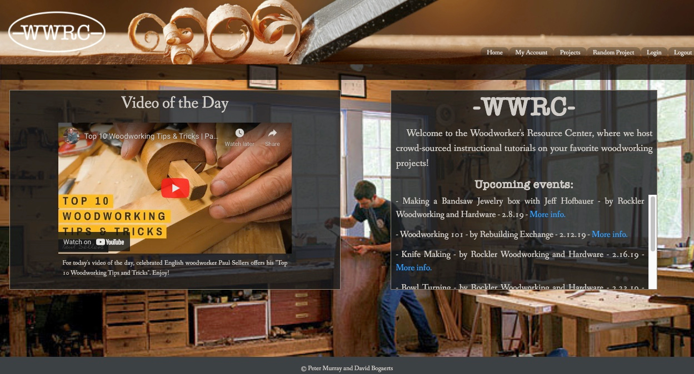
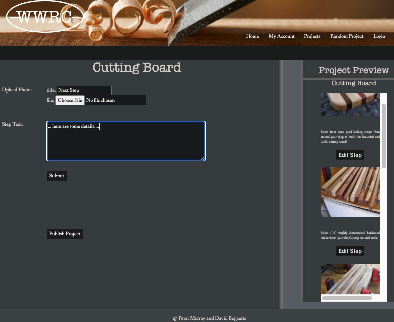

# WoodStruct
An interactive user-generated educational woodworking and tutorial website.

#### Woodstruct Documention -

{width="600", height="400"}

#### Features -

 * Allows a user to browse and upload user-generated step-wise visual tutorial woodworking projects as well as research techniques and tools related to the woodworking craft.

 *	On sign in or registering, the user will be taken to their user page where they will see their current projects and have the ability to edit and delete their current projects a well as create and add new projects to be published to the site.

{width="300", height="200"}

 * On the project page the user will see a “toolbox” with a list of necessary tools for the project along with resource links for tools/materials.  User will also be provided helpful instructional links, which will be locked on the left side of the page as the user scrolls through the project. The main body of the page will show stepwise instructions to build the project, including images and videos and helpful links the user can provide where appropriate. The user will also be able add a comment to a comments/feedback section on a project. The user will also be able to connect with other users via direct message to discuss/give feedback on other users projects. (Some features will be included/refined in upcoming versions).

#### Upcoming features -
  * User Chat capabilities
  * User Toolbox/ Tool Collection functionality

#### Requirements -
  Compatable with current browsers (Safari, Chrome, Firefox, Opera etc.)

#### People -
 * David Bogaerts - Web Developer/Woodworker
 * Peter Murray - Web Developer/Woodworker

#### License - Yup.

